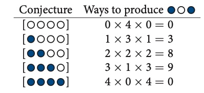

# Chapter 1 - Bayes, Multilevel Modeling, Information Criteria

## Hypotheses, Processes, and Statistical Models

-   A Standard notion about science is that it works by falsification (aka, Popperianism)

-   Scientific hypotheses are *not* models

-   A scientific hypothesis can be composed of many proposed processes

-   A scientific process may or may not be able to be directly modeled statistically, but for the most part statistical models are not scientific process models. 

-   So, one scientific hypothesis can relate to many process models which can be approximated using statistical models. Later on, there is a discussion of the Ptolemaic geocentric view of the solar system, which is akin to a statistical model that has much predictive power but absolutely no explanatory power. This is because, while you can create an arbitrarily complex (and therefore accurate) epicycle-based models (circles on circles), these models do not provide insight to the process that generates the phenomenon.

-   The statistical model can quickly become the "geocentric" model if care isn't taken to think scientifically.

-   Science is *consensual* **not** *logical*. The Ptolemaic view was ultimately rejected by consensus, not logic, since it made precisely accurate predictions without explaining accurately how orbits worked.

-   Part of this book builds up methods and critical thinking skills needed to ensure that we think scientifically and not purely statistically, becuase that is when we are most likely to fall prey to the allure of statistical models and all the baggage they carry with them

## Bayesian Data Analysis

-   Bayes inference is no more than counting the number of ways things can happen according to a set of assumptions - the larger the count, the higher the plausibility.

-   This directly relates to the idea of likelihood: given data, what model provides the best explanation for the data as defined by how likely the data is to occur given the model itself.

-   **Frequentism** is a subset of Bayesian inference that states that probabilities are defined as the connection of countable events and their frequencies in very large samples:

    -   The idea of a "population" distribution that is constantly being "sampled" by a "sampling distribution."

    -   This "population distribution" does not have uncertainty, only the measurements can (the sample)


## Multilevel Models

-   As the name implies, these are models contains within models. In other words, a model that is parameterized by other models. This leads to varying levels of uncertainty depending on the level of interest.

    -   Why use them?

        1.  To adjust estimates for repeat sampling - using the same entity for multiple observations

        2.  To adjust estimates for imbalance in sampling - using some entities more often than others

        3.  To study variation

        4.  To avoid averaging - example: averaging a variable in a regression analysis ---\> lose some variation

## Model Comparisons and Information Criteria

-   Information Criteria, such as the AIC (Akaike Information Criteria), allow us to compare models based on future predictive accuracy.

-   Overfitting: "Fitting is easy; prediction is hard. Future data will not be exactly like past data, and so any model that is unaware of this fact tends to make worse predictions than it could." The point being that **prediction accuracy is different than fit**.

# Chapter 2 - "Small Worlds and Larger Worlds"

-   "Small world" refers to the almost game-ified world where logic prevails

-   "Large world" refers to the real world where a model is deployed. This world is complex and significantly bigger than the small world, so there can be missing information in the "small world"

## Bayesian Counting and the Garden of Forking Data

-   Say we draw three marbles from a bag of 4 blue and white marbles, with replacement, such that we draw blue (b), white (w), then blue (b). We don't know the true marbles in the bag. These are the possibilities written in `tidyverse` code:


```{r}
library(tidyverse)
d <- tibble(p1 = 0,
         p2 = rep(1:0, times = c(1, 3)),
         p3 = rep(1:0, times = c(2, 2)),
         p4 = rep(1:0, times = c(3, 1)),
         p5 = 1) %>% 
  set_names(1:5) %>% 
  mutate(x = 1:4) %>% 
  pivot_longer(-x, names_to = "possibility") %>% 
  mutate(value = value %>% as.character()) %>% 

  ggplot(aes(x = x, y = possibility, fill = value)) +
  geom_point(shape = 21, size = 5) +
  scale_fill_manual(values = c("white", "navy")) +
  scale_x_discrete(NULL, breaks = NULL) +
  theme(legend.position = "none")
d
```

-   if we consider the possibility that the bag contains 1 blue and 3 white marbles (possibility #2), we can visualize the possible paths below:

```{r}
d <-tibble(position = c((1:4^1) / 4^0, (1:4^2) / 4^1, (1:4^3) / 4^2),
           draw=rep(1:3, times = c(4^1, 4^2, 4^3)),
           fill=rep(c("b", "w"), times = c(1, 3)) %>% 
        rep(., times = c(4^0 + 4^1 + 4^2))
        ) %>% 
  mutate(denominator = ifelse(draw == 1, .5,
                          ifelse(draw == 2, .5 / 4,
                                 .5 / 4^2))) %>% 
  mutate(position = position - denominator)


lines_1 <-tibble(x=rep((1:4), each = 4),
                 xend = ((1:4^2) / 4),y=1 ,yend=2) %>% 
  mutate(x=x-0.5,
         xend=xend-0.5/4^1)

lines_2 <-tibble(x=rep(((1:4^2) / 4), each=4),
                 xend=(1:4^3)/(4^2), y=2, yend=3) %>% 
  mutate(x=x-0.5/4^1,
         xend=xend-0.5/4^2)


plot <- d %>%
  ggplot(aes(x = position, y = draw)) +
  geom_segment(data = lines_1,
               aes(x = x, xend = xend,
                   y = y, yend = yend),
               size  = 1/3) +
  geom_segment(data = lines_2,
               aes(x = x, xend = xend,
                   y = y, yend = yend),
               size  = 1/3) +
  geom_point(aes(fill = fill),
             shape = 21, size = 3) +
  scale_fill_manual(values  = c("navy", "white")) +
  scale_y_continuous(breaks = 1:3) +
  # coord_polar() +
  theme(legend.position  = "none",
        panel.grid.minor = element_blank())

plot
```

-   as you can see, there are 3 possible ways for us to draw `bwb` if we assume the bag has only 1 blue marble.

-   If you do this for bags with 2 and 3 blue marbles you get 8, and 9 possible ways:

    

-   Now, if we draw a fourth marble after replacement and this marble is blue, what do we do?

    -   We now go through **Bayesian Updating** of the **prior**.

        -   **Bayesian Updating** - multiply the previous "Ways to produce" by the number of ways to product another blue marble for each possible marbled combination bags. In this case, the **prior** is the previous "Ways to produce"

        -   This procedure of updating allows us to (a) acquire new observations that we fold into our counting while (b) still accounting for the prior observations.

-   Let's show the visual representation of all 3 possible bag compositions (\<b,w,w,w\>, \<b,b,w,w\>, \<b,b,b,w\>). The code is complex and not necessary to understand the story that is being told, but feel free to interrogate it on your own!

```{r}
d <-tibble(position = c((1:4^1) / 4^0, 
                      (1:4^2) / 4^1, 
                      (1:4^3) / 4^2),
           draw = rep(1:3, times = c(4^1, 4^2, 4^3)))

d <- d %>% 
  bind_rows(
    d, d
  ) %>% 
  # here are the fill colors
  mutate(fill = c(rep(c("w", "b"), times = c(1, 3)) %>% rep(., times = c(4^0 + 4^1 + 4^2)),
                  rep(c("w", "b"), each  = 2)       %>% rep(., times = c(4^0 + 4^1 + 4^2)),
                  rep(c("w", "b"), times = c(3, 1)) %>% rep(., times = c(4^0 + 4^1 + 4^2)))) %>% 
  # now we need to shift the positions over in accordance with draw, like before
  mutate(denominator = ifelse(draw == 1, .5,
                              ifelse(draw == 2, .5 / 4,
                                     .5 / 4^2))) %>% 
  mutate(position = position - denominator) %>% 
  # here we'll add an index for which pie wedge we're working with
  mutate(pie_index = rep(letters[1:3], each = n()/3)) %>% 
  # to get the position axis correct for pie_index == "b" or "c", we'll need to offset
  mutate(position = ifelse(pie_index == "a", position,
                           ifelse(pie_index == "b", position + 4,
                                  position + 4 * 2)))

move_over <- function(position, index) {
  ifelse(
    index == "a", position,
    ifelse(
      index == "b", position + 4, position + 4 * 2
    )
  )
}

lines_1 <-
  tibble(x    = rep((1:4), each = 4) %>% rep(., times = 3),
         xend = ((1:4^2) / 4)        %>% rep(., times = 3),
         y    = 1,
         yend = 2) %>% 
  mutate(x    = x - .5,
         xend = xend - .5 / 4^1) %>% 
  # here we'll add an index for which pie wedge we're working with
  mutate(pie_index = rep(letters[1:3], each = n()/3)) %>% 
  # to get the position axis correct for `pie_index == "b"` or `"c"`, we'll need to offset
  mutate(x    = move_over(position = x,    index = pie_index),
         xend = move_over(position = xend, index = pie_index))

lines_2 <-
  tibble(x    = rep(((1:4^2) / 4), each = 4)  %>% rep(., times = 3),
         xend = (1:4^3 / 4^2)                 %>% rep(., times = 3),
         y    = 2,
         yend = 3) %>% 
  mutate(x    = x - .5 / 4^1,
         xend = xend - .5 / 4^2) %>% 
  # here we'll add an index for which pie wedge we're working with
  mutate(pie_index = rep(letters[1:3], each = n()/3)) %>% 
  # to get the position axis correct for `pie_index == "b"` or `"c"`, we'll need to offset
  mutate(x    = move_over(position = x,    index = pie_index),
         xend = move_over(position = xend, index = pie_index))

d <- d %>% 
  mutate(remain = c(#pie_index == "a"
                    rep(0:1, times = c(1, 3)),
                    rep(0,   times = 4),
                    rep(1:0, times = c(1, 3)) %>% rep(., times = 3),
                    rep(0,   times = 4 * 4),
                    rep(c(0, 1, 0), times = c(1, 3, 4 * 3)) %>% rep(., times = 3),
                    # pie_index == "b"
                    rep(0:1, each = 2),
                    rep(0,   times = 4 * 2),
                    rep(1:0, each = 2) %>% rep(., times = 2),
                    rep(0,   times = 4 * 4 * 2),
                    rep(c(0, 1, 0, 1, 0), times = c(2, 2, 2, 2, 8)) %>% rep(., times = 2),
                    # pie_index == "c",
                    rep(0:1, times = c(3, 1)),
                    rep(0,   times = 4 * 3),
                    rep(1:0, times = c(3, 1)), 
                    rep(0,   times = 4 * 4 * 3),
                    rep(0:1, times = c(3, 1)) %>% rep(., times = 3),
                    rep(0,   times = 4)
                    )
         )

lines_1 <- lines_1 %>% 
  mutate(remain = c(rep(0,   times = 4),
                    rep(1:0, times = c(1, 3)) %>% rep(., times = 3),
                    rep(0,   times = 4 * 2),
                    rep(1:0, each  = 2) %>% rep(., times = 2),
                    rep(0,   times = 4 * 3),
                    rep(1:0, times = c(3, 1))
                    )
         )

lines_2 <- lines_2 %>% 
  mutate(remain = c(rep(0,   times = 4 * 4),
                    rep(c(0, 1, 0), times = c(1, 3, 4 * 3)) %>% rep(., times = 3),
                    rep(0,   times = 4 * 8),
                    rep(c(0, 1, 0, 1, 0), times = c(2, 2, 2, 2, 8)) %>% rep(., times = 2),
                    rep(0,   times = 4 * 4 * 3),
                    rep(0:1, times = c(3, 1)) %>% rep(., times = 3),
                    rep(0,   times = 4)
                    )
         )

d %>% 
  ggplot(aes(x = position, y = draw)) +
  geom_vline(xintercept = c(0, 4, 8), color = "white", size = 2/3) +
  geom_segment(data = lines_1,
               aes(x = x, xend = xend,
                   y = y, yend = yend,
                   alpha = remain %>% as.character()),
               size = 1/3) +
  geom_segment(data = lines_2,
               aes(x = x, xend = xend,
                   y = y, yend = yend,
                   alpha = remain %>% as.character()),
               size = 1/3) +
  geom_point(aes(fill = fill, size = draw, alpha = remain %>% as.character()),
             shape = 21) +
  scale_fill_manual(values = c("navy", "white")) +
  scale_size_continuous(range = c(3, 1.5)) +
  scale_alpha_manual(values = c(0.2, 1)) +
  scale_x_continuous(NULL, limits = c(0, 12), breaks = NULL) +
  scale_y_continuous(NULL, limits = c(0.75, 3.5), breaks = NULL) +
  coord_polar() +
  theme(legend.position = "none",
        panel.grid = element_blank())
```

-   If we go back to the first part of this thought exercise where we draw `bwb` marbles, recognize that we used the least informative prior, where we assumed all possibilities of bag composition were equally likely. If we had further information that we could have constructed a more precise prior, but we didn't. This is called the **principle of indifference**.

-   Helpful definitions that are already developed in this framework:

    -   **Parameter** - The conjecture or, in other words, the possible explanations of the data (i.e., the possible bag contents)

    -   **Likelihood** - The relative number of ways that a given parameter can produce the observed data (i.e., the counting exercise)

    -   **Prior Probability** - The previous plausibility of any specific parameter value

    -   **Posterior Probability** - The updated plausibility of any specific parameter value given new data
    
## Binomial Distribution

-   Binomial Coefficient (i.e., $n$ objects choose $k$ objects): $\binom{n}{k} = \frac{n!}{k!(n-k)!}$

    -   In the marble example above, say we have 4 marbles and we select 3 of them. Therefore:

        -   $\binom{4}{3} = \frac{4!}{3!(4-3)!} = \frac{4\times3\times2\times1}{3\times2\times1\times1} = 4$

        -   So, this shows us that with 4 marbles in the bag, there are 4 ways to select 3 marbles

            -   1,2,3

            -   1,3,4

            -   2,3,4

            -   1,2,4

-   Binomial Distribution:

    -   Say we wanted to compute the probability of selecting 2 blues in 3 tosses if there were 50% chance of pulling a blue (2 blues 2 whites)

    -   $Pr(w|n,p) = \frac{n!}{w!(n-w)!}\times p^{w}(1-p)^{(n-w)}$ so therefore $Pr(2|3,.5) = \frac{3!}{2!(3-2)!}\times .5^{2}(1-.5)^{(3-2)} = \frac{3\times2\times1}{2\times1\times1}\times 0.5^2(.5^1) = 3 \times .5^3 = .375$

    -   The interpretation: there are 4 ways to get 2 blues in 3 tosses, each way has 37.5% chance of happening

    -   This can be calculated using a simple R function `dbinom`

```{r echo=TRUE}
dbinom(x=2, size=3, prob=.5)
```

## Bayes Theorem

A purely mathematical notion of posteriors, likelihoods, and priors can be written as follows:

$Pr(w,p) = Pr(w|p)Pr(p)$

To make this concrete, lets say $w$ represents a rainy day and $p$ represents a cold day. So, the probability of experiencing a rainy day AND a cold day (the "Joint" probability) is equivalent to the probability of experiencing a rainy day when it is cold (the **likelihood**) multiplied by the probability of a cold day (the **prior).** This is equivalent to the following:

$Pr(w,p) = Pr(p|w)Pr(w)$

Which states that the probability of experiencing a rainy day AND a cold day (the "Joint" probability) is equivalent to the probability of experiencing a cold day when it is rainy (the **likelihood**) multiplied by the probability of a rainy day (the **prior).** Note how these two conceptions are identical. So:

$Pr(w,p) = Pr(w|p)Pr(p) = Pr(p|w)Pr(w)$

and this equation is equivalent to:

$Pr(p|w) = \frac{Pr(w|p)Pr(p)}{Pr(w)}$

which is **Bayes Theorem**. Don't worry too much about the denominator, all it does is standardize the posterior (the $Pr(p|w)$) such that all posteriors sum to 1.

**THE KEY IS THAT THE POSTERIOR IS PROPORTIONAL TO THE PRODUCT OF THE PRIOR AND THE LIKELIHOOD.**

## Making our First "Motor" (a.k.a., Model)

-   a statistical model, in it's simplest form, is a little machine that does exactly what it is programmed. A simple form of a model for Bayesian updating is a little engine that takes a prior distribution, multiplies it by a likelihood, and returns the posterior distribution.

-   The three methods we can use to create this Bayesian updating model include:

    1.  Grid approximation

    2.  Quadratic approximation

    3.  Markov chain Monte Carlo (MCMC)

### Grid Approximation

-   Grid Approximation uses a finite grid of values to approximate the parameter distributions

-   Grid Approximation is helpful for conceptual understanding but it does not scale

-   We are showing the posterior distribution of the parameter, $p$, which represents say the proportion of water on a globe. In this thought exercise, we just randomly spun a globe and dropped a pin on it, and 5 of the 7 spins ended up with the pin in the ocean. So, the following posterior distribution shows the plausibility of values for $p$ given this information.

```{r}
GRID_LEN = 100

# define grid of parameter values
# This is 100 discrete numbers between 0 and 1
p_grid <- seq(from=0, to=1, length.out=GRID_LEN)

# define the prior
prior <- rep(1, GRID_LEN)

# compute likelihood at each value in grid
likelihood <- dbinom(x=5, size=7, prob=p_grid)

# compute product of likelihood and prior
unstd.posterior <- likelihood * prior

# standardize the posterior, so it sums to 1
posterior <- unstd.posterior / sum(unstd.posterior)

# Plot the distributions
plot(p_grid, posterior, type="b", 
     xlab = "probability of water", ylab = "posterior prob")
mtext(paste(GRID_LEN,"points"))
```

#### Quadratic approximation

-   Quadratic approximations scales better than grid approximation

-   It works in two steps

    1.  Use some sort of gradient ascent algorithm to find the peak

    2.  estimate the curvature near the peak and then the quadratic approximation (reminiscent of a Taylor series expansion)

```{r}
library(rethinking)
globe.qa <- quap(
  alist(
    w ~ dbinom(9,p),
    p ~ dunif(0,1)
  ),
  data = list(w=6)
)

# display the summary of the quadratic approximation
precis(globe.qa)
```

-   As you can see below, as we increase the number of samples, the curve starts to appear more and more "normal"

```{r}
# wrangle
tibble(w = c(6, 12, 24),
       n = c(9, 18, 36),
       s = c(.16, .11, .08)) %>% 
  expand(nesting(w, n, s),
         p_grid = seq(from = 0, to = 1, length.out = GRID_LEN)) %>% 
  mutate(prior = 1,
         m     = .67)  %>%
  mutate(likelihood = dbinom(w, size = n, prob = p_grid)) %>%
  mutate(unstd_grid_posterior = likelihood * prior,
         unstd_quad_posterior = dnorm(p_grid, m, s)) %>%
  group_by(w) %>% 
  mutate(grid_posterior = unstd_grid_posterior / sum(unstd_grid_posterior),
         quad_posterior = unstd_quad_posterior / sum(unstd_quad_posterior),
         n              = str_c("n = ", n)) %>% 
  mutate(n = factor(n, levels = c("n = 9", "n = 18", "n = 36"))) %>% 
  
  # plot
  ggplot(aes(x = p_grid)) +
  geom_line(aes(y = grid_posterior)) +
  geom_line(aes(y = quad_posterior),
            color = "grey50") +
  labs(x = "proportion water",
       y = "density") +
  theme(panel.grid = element_blank()) +
  facet_wrap(~ n, scales = "free")
```


# Chapter 3 - "Sampling the Imaginary"
## Why sample? and why significance tests are regularly bad

-   Bayes theorem is often taught through the lense of a medical test:

-   Ex: What is the probability of having covid given a postive pcr test?

  -   Let $Pr(pos|covid) = 0.98$ ([link](https://www.uptodate.com/contents/covid-19-diagnosis))

  -   Let $Pr(pos|health) = 0.004$ ([link](https://journals.asm.org/doi/10.1128/JCM.01080-21))

  -   Let $Pr(covid) = 0.05$ (just assume 5% of people actively have covid in your area)

  -   Using Bayes theorem: $$
      Pr(covid|pos) = \frac{Pr(pos|covid)Pr(covid)}{Pr(pos)}
      $$

      where $Pr(pos) = Pr(pos|covid)Pr(covid) + Pr(pos|healthy)Pr(healthy)$
      So: $Pr(covid|pos) = \frac{0.98 \times 0.25}{0.98 \times 0.05 + 0.004 \times 0.75} = 98.8\%$

  -   It's kind of unnatural to think like this, but lets convert it to frequencies instead

      -   In population of 100,000 people, 25,000 have covid

      -   Out of the 25,000 who have covid, 24,500 test positive

      -   of the 75,000 healthy people, 300 test positive

      -   So, then the thought is much more straightforward

          $$
          Pr(covid|pos) = \frac{24,500}{24,500+300} = 98.8\%
          $$

      -   This *frequency format* allows us to exploit the use of **sampling**, in addition to the fact that **sampling** allows us to use more advanced methods down the line like **Markov chain Monte Carlo**, which is a sampling-based procedure that will be discussed later.

-   Really interesting "Rethinking" section in the book worth discussing here. THIS IS SOMETHING WORTH REMEMBERING FOR FUTURE STATISTICAL WORK.

  Scientific inferences are often structured in the following way

  1.  A hypothesis is either true or false

  2.  We use a statistical procedure to get an imperfect clue of the hypothesis' falsity

  3.  We use Bayes' theorem to logically deduce the impact of this clue on the state of the hypothesis

  We don't often see step 3. get completed in real life though ... All one needs to do is to think about how often research is proven wrong even though the study that generated the results presented a small $\alpha$ value. Just because an alpha for a statistical model is low does not mean the process model or the scientific hypothesis is correct.


## Grid approximation sampling

Below, we are going to manufacture a posterior distribution and then sample from it (the first plot). Then we look at the distribution of values in the second plot.

```{r}
GRID_LEN = 1000
p_grid <- seq(from=0, to=1, length.out=GRID_LEN)
prior <- rep(1, GRID_LEN)
likelihood <- dbinom(6, size=9, prob=p_grid)
posterior <- likelihood * prior
posterior <- posterior / sum(posterior)

## Now let's sample this posterior distribution
SAMPLE_SIZE = 2e5
samples <- sample(p_grid, prob=posterior, size=SAMPLE_SIZE, replace=T)
plot(samples)
dens(samples)
```

The first plot is as if you were flying over the samples from the posterior distribution. The second plot is if you were looking at it from the side with all the samples stacked on top of each other.

### Questions to ask to summarize distribution

#### What is the posterior probability that the proportion of water is less than 50%?

well thats easy:

```{r}
sum(posterior[p_grid<0.5])
```

but, if we didn't have the grid approximation `posterior`, and all we had were samples from the posterior, then its still pretty much just as easy:

```{r}
sum(samples<0.5)/SAMPLE_SIZE
```

clearly the sample based method is not exact, but it is really close.

#### How much of the posterior distribution lies between 0.5 and 0.75?

```{r}
sum(samples > 0.5 & samples < 0.75)/SAMPLE_SIZE
```

#### How much interval is covered by 80% of the bottom of the mass?

```{r}
quantile(samples, 0.8)
```

#### What is the middle 80% interval using the 10th and 90 percentiles?

```{r}
quantile(samples, c(0.1,0.9))
```

### Point Estimates

We have seen above that there are way to describe the posterior distribution using density/mass over a specified region of possible parameter values, as well as specifying the mass and then finding the areas that comply with that mass. Is there a way to summarize the distribution using a single point? kind of, yes.

#### Loss Functions

-   We can use a principled approach to selecting a point estimate if we employ a loss function. Say we wanted to pick a point estimate that best estimates the parameter such that you get \$100 if you're right. If you're wrong, a proportional amount is subtracted from the winnings.

-   So, we want $|d - p|$ where $d$ is the point estimate and $p$ is the actual parameter value. What $d$ do you pick? well let's use our grid approximation to determine that

```{r}
loss <- sapply(p_grid, function(d) sum(posterior*abs(d-p_grid)))
```

-   The `loss` vector above shows us the loss value over each possible parameter \$p\$ in our grid. What is the minimum?

```{r}
p_grid[which.min(loss)]
```

-   Another standard loss function is the quadratic loss function, which squares $d-p$ instead of taking the absolute value: $$(d-p)^2$$

## Sampling / Simulation / Dummy Data

-   Likelihoods are bidirectional such that:

    1.  Given an observation, the likelihood tells us the most plausible parameter (or, more accurately, the plausibilities of all possible parameters)

    2.  Given a parameter, the likelihood gives us a distribution of possible observations to sample from (SIMULATION)

    3.  This is what it means when we say that Bayesian models are **generative**.

-   From bullet 1. above:

```{r}
dbinom(0:2, size=2, prob=0.7)
```
    So, this means that given $p=0.7$, there is a 9% chance of observing an observation of value 0, a 42% chance of observing an observation with value 1, and a 49% chance of observing an observation with value 2.

-   Now, let's turn to the generative side. `rbinom` generates random samples from a binomial distribution.
```{r}
rbinom(10, size=2, prob=0.7)
```
    
-   Now, let's generate 100,000 random samples. Note how the relative frequencies match the dbinom from above (very closely):
```{r}
SAMPLE_SIZE = 1e5
dummy_w <- rbinom(SAMPLE_SIZE, size=2, prob=0.7)
table(dummy_w)/SAMPLE_SIZE
```
-   Histograms:
```{r}
SAMPLE_SIZE = 1e5
SIZE = 9
PROB  = 0.7
dummy_w <- rbinom(SAMPLE_SIZE, size=SIZE, prob=PROB)
simplehist(dummy_w, xlab='dummy water count')
```

-   Recall, above we generated simulated samples from the posterior distribution of the parameter value (proportion of water), given that we had tossed the globe and found that 6 of the 9 tosses landed on the water. Remember, this logically implied a plausibility distribution over all the possible values of $p$. So, since we don't strictly know $p$, we should model uncertainty about it instead of simply just selecting the mode, mean, or median (point estimates). We do that in the code cell below by not passing the value 0.6 to the `prob` argument, but instead we pass it all the samples from the parameter's posterior distribution. Notice how `w_bad` in the following code chunk is far more certain about the value of water globe tosses compared to `w_good`.

```{r}
w_bad <- rbinom(SAMPLE_SIZE, size=9, prob=0.6)
w_good <- rbinom(SAMPLE_SIZE, size=9, prob=samples)
simplehist(w_bad)
simplehist(w_good)
```

## Chapter 3 Hard Homeworks

Below are some of the hard homework questions from chapter 3

### 3H1
```{r}
library(rethinking)
data(homeworkch3)

boys <- sum(birth1) + sum(birth2)
total_n_children <- length(birth1) + length(birth2)

## Generating the grid
GRID_LEN = 1000
p_grid <- seq(from=0, to=1, length.out=GRID_LEN)
prior <- rep(1, GRID_LEN) ## Uniform prior distribution

likelihood <- dbinom(boys, size=total_n_children, prob=p_grid)
posterior <- likelihood * prior
posterior <- posterior / sum(posterior)

#plotting
plot(posterior ~ p_grid , type="l" )
abline( v=0.5 , lty=2 )

# using the maximum a posteriori (MAP), AKA the mode
p_grid[which.max(posterior)]
```

### 3H2
```{r}
    SAMPLE_SIZE = 1e5
    samples <- sample(p_grid, prob=posterior, size=SAMPLE_SIZE, replace=T)
    # plot(samples)
    # dens(samples)
    
    PI(samples, 0.5)
    PI(samples, 0.89)
    PI(samples, 0.97)
```

### 3H3
```{r}
dummy_b <- rbinom(1e5, 200, prob=samples)
dens(dummy_b, xlab='dummy boy count')
abline( v=sum(birth1)+sum(birth2) , col="red" )
```


### 3H4
```{r}
b1sim <- rbinom( 10000 , size=100 , prob=samples )
dens( b1sim, adj=1 )
abline( v=sum(birth1) , col="red" )
```


### 3H5
```{r}
birth_following_girl <- birth2[birth1==0]
b01sim <- rbinom(1e5, size=length(birth_following_girl), prob=samples)
dens(b01sim,adj=.1)
abline( v=sum(birth_following_girl) , col="red" )
```


# Chapter 4 - "Linear Models"
- This chapter starts with the really cool example of ptolemy's geocentric model of the universe, whereby he used circles on circles (epicycles) to model the orbit of mars.
- This type of model allows for predictions, as long as these predictions have a very narrow scope: "Where will mars be at time $t$".
- This type of model does not allow for a full understanding of the orbital process though, its simply a summary of outcomes (the golem)
- **Linear Regression** is the geocentric model of applied stats.
- **Linear Regression** is the motor that learns the mean and variance of a measurement.
- **Linear Regression** can describe many, and I mean MANY, phenomena, yet the linear model itself can correspond to multiple process models (the HOW something works, not just the WHAT something produces)

## Random walk

say you walk a random distance between -1 foot and 1 foot, 16 times. How far do you end up?

Well, it ends up being approximately a Gaussian curve because the sum of the positive and negative steps have the most number of ways (garden of forking data) of being realized, hence the density is largest in those regions (closer to zero). Remember Bayesian inference is just counting.

```{r}
N_STEPS <- 16
pos <- replicate(100000, sum(runif(N_STEPS,-1,1)))
dens(pos)
```

## Small rates are also similar to counting
- It turns out that multiplication can also be approximately normal, as long as the rates are sufficiently small. Here is an example:
- suppose there is a bacteria that increases by something between 0% and 5% daily if untreated, lets visualize the growth distribution after 16 days:

```{r}
n_days <- 16
max_rate <- 0.05
growth <- replicate(1e4, prod(1+runif(n_days,0,max_rate)))
dens(growth)
```

- This is because multiplication at small numbers is essentially addition as the equation below indicates (intuitively). Say bacteria grow at 10% for two days in a row:
$$
1.1 \times 1.1 = 1.21
$$

- We could also approximate this product by just adding the increases (10% + 10%) and be off by only 0.01.
$$ 1.1 \times 1.1 = (1+01)(1+01) = 1+0.2+ 0.01 \approx 1.2$$

- The bigger the rate, the less normal the distribution appears
```{r}
n_days <- 16
max_rate <- 0.5
growth <- replicate(1e4, prod(1+runif(n_days,0,max_rate)))
dens(growth, norm.comp = T)
```

But, when the rates get big, we can simply use a log transformation and the distribution becomes Gaussian again:
```{r}
log.big <- replicate(1e4, log(prod(1 + runif(n_days,0,max_rate))))
dens(log.big, norm.comp = T)
```


- There are two philosophical reasons to use Gaussians
    1. *Ontological*: Gaussians are super common in nature (measurement error, growth rates, molecule velocities, human height variation). This is because all these processes are additive (or essentially additive, as the thought exercise about small rates showed above).  
    2. *Epistemological*: Gaussians represent a particular state of ignorance. This is related to **Information Theory** and **Maximum Entropy** discussed later on.
    
- *Technical Note*: The Gaussian get's it's shape exclusively through the $-(y-u)^2$ component that is exponentiated. All the prefixed parts of the equation just scale it such that the integral of the curve is 1. So, the farther away an observation is from the mean, the larger the magnitude the negative number is in the exponent. $e^0 > e^{-1} > e^{-2}>...> e^{-\inf})$


## A Gaussian Model of Height

- Here is a dataset that has information about height, weight, age, and gender.
```{r}
library(rethinking)
data("Howell1")
d <- Howell1
d
```

- Filtering the data to only adults (defined by being >= 18 years old)
```{r}
d2 <- d[d$age>=18,]
```

- We can say that:
$$
h_i \sim Normal(\mu,\sigma)\\
 \mu \sim Normal(178,20)\\
\sigma \sim Uniform(0,50)
$$
- So, heights are distributed normally with mean $\mu$ and standard deviation $\sigma$. The prior distribution for $\mu$ is normally distributed with some domain specific knowledge. Here is our prior distribution of height.

```{r}
curve(dnorm(x, 178, 20), from=100, to=250)
```

- And here is our prior distribution for the standard deviation of height:

```{r}
curve( dunif(x, 0, 50), from=-10, to=60)
```

- Now, we can start generating samples from these distributions of $\mu$ and $\sigma$

```{r}
SAMPLE_SIZE = 1e4
sample_mu <- rnorm(SAMPLE_SIZE, 178, 20)
sample_sigma <- runif(SAMPLE_SIZE, 0, 50)
prior_h <- rnorm(SAMPLE_SIZE, sample_mu, sample_sigma)
dens(prior_h)
```

```{r}
# grid approximation of mu
mu.list <- seq(from=140, to=160, length.out=200)

# grid approximation of sigma
sigma.list <- seq(from=4, to=9, length.out=200)

# cartesian product of grids (THIS IS WHY GRID APPROXIMATION ISN'T SCALEABLE)
post <- expand.grid(mu=mu.list, sigma=sigma.list)
post$LL <- sapply(1:nrow(post), function(i)sum(dnorm(
  d2$height,
  mean=post$mu[i],
  sd=post$sigma[i],
  log=TRUE
)))

post$prod <- post$LL + dnorm(post$mu, 178, 20, TRUE) + 
  dunif(post$sigma, 0, 50, TRUE)

post$prob <- exp(post$prod - max(post$prod))
post
```
```{r}
image_xyz(post$mu, post$sigma, post$prob)
```
- Now, we want to sample from this distribution. We will do this by sampling random rows in proportion to their posterior probability:

```{r}
sample.rows <- sample(1:nrow(post), size=SAMPLE_SIZE, replace=TRUE, prob=post$prob)
sample.mu <- post$mu[sample.rows]
sample.sigma <- post$sigma[sample.rows]

plot(sample.mu, sample.sigma, cex=.8, pch=1, col=col.alpha(rangi2,0.1))
```
```{r}
dens(sample.mu, adj = 1)
dens(sample.sigma, adj=1)
```

```{r}
HPDI(sample.mu)
HPDI(sample.sigma)
```

## Fitting the model with `quap`
- What is `quap`? `quap` works by using the model definition (the $h_i, \mu, \sigma$ as defined in the model definition above), to find the posterio probability at each combination of parameter values then it climbs the posterior until it finds the peak, the MAP, *maximum a posteriori*.

```{r}
library(rethinking)
data(Howell1)
d <- Howell1
d2 <- d [ d$age >= 18, ]
```

- Now, let's get this into a more standard statistical model semantics
```{r}
flist <- alist(
  height ~ dnorm(mu, sigma),
  mu ~ dnorm(178, 20),
  sigma ~ dunif(0, 50)
)

m4.1 <- quap(flist, data=d2)
precis(m4.1)
```

- What if we wanted to change the prior distribution of $\mu$ such that it is much more concentrated around 178cm? we could drop the $\sigma$. Let's play around and find out:

```{r}
m4.2 <- map(alist(
  height ~ dnorm(mu, sigma),
  mu ~ dnorm(178, 10),
  sigma ~ dunif(0, 50)
), data=d2)

precis(m4.2)
```
- So, clearly dropping the $\sigma$ value in half didn't do much at all to our posterior distribution. What happens if we drop it even further?

```{r}
m4.3 <- map(alist(
  height ~ dnorm(mu, sigma),
  mu ~ dnorm(178, .1),
  sigma ~ dunif(0, 50)
), data=d2)

precis(m4.3)
```

- Notice, now our prior distribution for mu is extremely narrowly centered on 178 with extremely low plausibilities that the value is any different. So, our posterior distribution has a mean that essentially hasn't moved off the prior (178 vs 177.86). Yet, the posterior distribution for $\sigma$ is much much larger. This happens because our model must estimate a $\sigma$ value conditional on the fact that the prior for $\mu$ is pretty much guaranteed to be 178.

### Sampling from the `quap` fit
When R computes the quadratic approximation, it has to calculate covariances between all the parameters (as well as the variance of the parameter values themselves).

```{r}
vcov( m4.1 )
```

- We can read this as:
    - the variance of $\mu$ is 0.1697
    - the variance of $\sigma$ is 0.0849

These can be converted to standard deviations that match our precis from above:
```{r}
round(0.1697396837^(1/2),2)
print('this matches 0.41 from the precis output')
round(0.0849059133^(1/2),2)
print('this matches 0.29 from the precis output')
```


- We can also changes these to show correlation:

```{r}
cov2cor( vcov(m4.1) )
```

- All this is to say, if you want to sample the quadratic approximation, it must maintain the covariance between parameters, not just the variance of the parameters themselves. The `rethinking` package provides a way to do this:
```{r warning=FALSE}
library(rethinking)
post <- extract.samples(m4.1, n=1e4)
precis(post)
```


### Adding in a predictor
- Recall d2 shows the height and weight for Kalahari adults (over 18)
```{r}
head(d2)
```

- Now, let's visualize this covariance

```{r}
plot(d2$height ~ d2$weight)
```


- Instead of just using the mean height, we can enforce that the height is a linear function of weight.
    - Note, there is no rule anywhere that states the function needs to be linear like: $\mu_i = \alpha + \beta x_i$. We could use a model that is more informed by domain knowledge if we wanted, but in most cases the linear model is used. It is analagous to utilizing a "geocentric" model of the solar system.

- So, let's write our linear model in stats speak:

$$
h_i \sim N(\mu_i, \sigma) \\
\mu_i = \alpha + \beta x_i \\
\alpha \sim N(178, 100) \\
\beta \sim N(0, 10) \\
\sigma \sim U(0, 50)
$$
- This tells us that our 
    - height is a normally distributed with a mean of $\mu_i$, but that our $\mu_i$ is not the same all the time
    - $\mu_i$ is a function of height where:
       - $\alpha$ is the intercept (the height of someone who is 0 pounds...) and has a weak prior of 178 cm with a standard deviation of 100
       - $\beta$ is the strength of association between weight and height and has a weak prior of 0 (no relationship) with equal probability that the relationship is positive or negative (likely a poor choice of a prior)
       - $\sigma$ is the same as before
    
```{r message=TRUE, include=FALSE}
library(rethinking)
data("Howell1")
d <- Howell1
d2 <- d[d$age>=18,]

# Fitting the model
m4.3 <- quap(
  alist(
    height ~ dnorm(mu, sigma),
    mu <- a + b*weight,
    a ~ dnorm(156, 100),
    b ~ dnorm(0, 10),
    sigma ~ dunif(0,50)
  ), data=d2
)
```

### Model Interpretation
```{r}
precis(m4.3)
cov2cor(vcov(m4.3))
```
- In this case, the $\alpha$ makes little sense since it is interpreted as "the height of someone with 0 weight is 113.90 cm." This is nonsense. If we transform the weight predictor such that it always shows deviations from the average height it becomes more helpful. Also, note that the standard deviation is 5. So about 2 standard deviations on either side (103.9 - 123.9) is the 95% density in the posterior.

- So, to fix the intercept interpretation issue, let's center the data
```{r}
d2$weight.c <- d2$weight - mean(d2$weight)
head(d2, 3)
```

- Now we can fit the model using the centered weight column, `weight.c`, instead of simply using `weight`.

```{r}
m4.4 <- quap(
  alist(
    height ~ dnorm(mu, sigma),
    mu     <- a + b*weight.c,
    a      ~ dnorm(178, 100),
    b      ~ dnorm(0, 10),
    sigma  ~ dunif(0, 50)
  ),
  data = d2
)

precis(m4.4)
```

- Now, $\alpha$ represents the mean weight when the height is the mean height.

- So let's plot this (uncentered) model with the data:
```{r}
plot(height ~ weight, data=d2)
abline(a=coef(m4.3)["a"], b=coef(m4.3)['b'])
```
- Now we can do it the ggplot way
```{r}
ggplot(data=d2, aes(x=weight, y=height))+
  geom_point() +
  geom_smooth(method="lm", formula=y~x)+
  theme_minimal()
```

- The ggplot2 version already shows some uncertainty around the regression line. But, let's build it up from the ground up. For right now, all we really know is the black line, which represents the *maximum a posteriori* combination of $\alpha$ and $\beta$. If we want to show some uncertainty, we could samples of $\alpha$ and $\beta$ from our quadratic approximation model like such:
```{r}
post <- extract.samples(m4.3)
post
```

- To really highlight how more data --> more confident posterior distributions of alpha and beta (less uncertainty), let's build up the example with only a few data points and then, as we continue to add more data to the model, we can observe how the scatter around $\alpha$ and $\beta$ shrink.

```{r}
N <- 300
dN <- d2 %>% 
  slice_sample(n=N)

mN <- rethinking::map(
  alist(
    height ~ dnorm(mu, sigma),
    mu <- a + b*weight,
    a ~ dnorm(178, 100),
    b ~ dnorm(0, 10),
    sigma ~ dunif(0, 50)
  ),
  data=dN
)
```

- Now that we have the fit model, lets plot twenty sampled lines:
```{r}
samples <- 20
post <- extract.samples(mN, n=samples)
plot(dN$weight, dN$height, 
     xlim=range(d2$weight),ylim=range(d2$height),
     col=rangi2, xlab='weight', ylab='height')
mtext(paste0("N = ",N))

for (i in 1:samples)
  abline(a=post$a[i], b=post$b[i], col=col.alpha("black",0.3))

```

- Finally, let's create a confidence interval (shaded) around the regression line

```{r}
mu_at_50 <- post$a + post$b * 50
dens(mu_at_50, col=rangi2, lwd=2, xlab = "mu|weight=50", show.HPDI=T, adj = 1)
HPDI(mu_at_50, prob=0.89)
```

- So this shows us that, conditional on the model and data, the central 89% of the ways for the model to produce the data puts the average height between 158.3 and 159.5 centimeters. Now, this needs to be done for all the other points, not just for those who weight 50kg.
```{r}
mu <- link(m4.3)
str(mu)
```

```{r}
weight.seq <- seq(from=25, to=70, by=1)
mu <- link(m4.3, data=data.frame(weight=weight.seq))
str(mu)
```

```{r}
plot(height~weight, d2, type="n")
for (i in 1:1000)
  points(weight.seq, mu[i,], pch=16, col=col.alpha(rangi2, 0.5))
```

```{r warning=FALSE}
mu.mean <- apply(mu,2,mean)
mu.HPDI <- apply(mu,2,HPDI,prob=0.89)
plot(height~weight, d2, col=col.alpha(rangi2, 0.5))
lines(weight.seq, mu.mean)
shade(mu.HPDI, weight.seq)
```

- Let's backup here a little bit and think about what this plot is showing. It shows us the data points (obviously), it shows us the maximum a posteriori mean height *for each weight*, and it shows us the 89% confidence interval of the mean *for each weight*. Think back to our mathstats view of this model (omitting priors for brevity):
$$
\space height_i \sim Normal(\mu_i, \sigma) \\
\space \mu_i = \alpha + \beta x_i
$$

- Notice how there are **two** parts here: height is linearly related to weight (what we just looked at), but height ***also has its own variation around the mean ($\sigma$)***. This means that there is uncertainty in all posterior estimates *as well as* uncertainty in the Gaussian likelihood. Below, we are simulating 1000 heights **for each weight between 25 and 70**.

```{r warning=FALSE}
sim.height <- sim(m4.3, data=list(weight=weight.seq))
sim.height <- as.tibble(sim.height)
sim.height
```
- Now, we can find the 89% probability density of height for each of the 46 weights
```{r}
height.PI <- apply(sim.height, 2, PI, prob=0.89)
head(as.tibble(t(height.PI)))
```

- Finally, we can plot this
```{r warning=FALSE}
# Setting the density interval
height.PI.67 <- apply(sim.height, 2, PI, prob=0.67)
height.PI.89 <- apply(sim.height, 2, PI, prob=0.89)
height.PI.99 <- apply(sim.height, 2, PI, prob=0.99)

plot(height ~ weight, d2, col=col.alpha(rangi2, 0.5))
# plot the regression line
lines(weight.seq, mu.mean)
# shade the HPDI region for the line
shade(mu.HPDI, weight.seq, col = col.alpha(rangi2, 0.5))
# shae the HPDI region for simulated weights
shade(height.PI.67, weight.seq)
# shae the HPDI region for simulated weights
shade(height.PI.89, weight.seq)
# shae the HPDI region for simulated weights
shade(height.PI.99, weight.seq)
```


This puts it all together. We are showing:
1. The data points
2. The MAP (maximum a posteriori) regression line
3. The uncertainty around the MAP regression line (blue shaded area)
4. The uncertainty around the simulations (as dictated by $\sigma$) when
  1. $\sigma = 0.67$
  1. $\sigma = 0.89$
  1. $\sigma = 0.99$


### Polynomial Regressions
- We can include higher order polynomial models to fit the data better. However, realize that this sort of model is directly analagous to a geocentric view of the solar system. This is because we can build up arbitrarily complex polynomial models that can fit the data perfectly, with enough polynomial terms. However, this is almost guaranteed to not *explain* the relationship anymore. Therefore it becomes good at fitting the data but not good at predicting the data. In other words, a model like this has extremely low bias and extremely high variance. 

Here is an example model:
$$
height_i \sim Normal(\mu_i, \sigma) \\
\mu_i = \alpha +\beta_1x_i + \beta_2x_i^2 + \beta_3x_i^3
$$
lets instantiate a model using `quap`:
```{r warning=FALSE}
# standardizing the weight
d$weight.s <- (d$weight - mean(d$weight))/sd(d$weight)

# engineering the polynomial features
d$weight.s2 <- d$weight.s^2
d$weight.s3 <- d$weight.s^3

# fitting the model
m4.6 <- quap(
  alist(
    height ~ dnorm(mu, sigma),
    mu <- a + b1*weight.s + b2*weight.s2 + b3*weight.s3,
    a ~ dnorm(178, 100),
    b1 ~ dnorm(0, 10),
    b2 ~ dnorm(0, 10),
    b3 ~ dnorm(0, 10),
    sigma ~ dunif(0, 50)
  ),
  data=d
)

# plotting
plot(height ~ weight.s, d, col=col.alpha(rangi2,0.5), xaxt='n')
at <- c(-2, -1, 0, 1 , 2)
labels <- at*sd(d$weight) + mean(d$weight)
axis(side = 1, at = at, labels = round(labels, 1))

weight.seq <- seq(from=-2.2, to=2, length.out=30)
pred_dat <- list(weight.s = weight.seq, weight.s2=weight.seq^2, weight.s3=weight.seq^3)
mu <- link(m4.6, data=pred_dat)
mu.mean <- apply(mu, 2, mean)
mu.PI <- apply(mu, 2, PI, prob=0.89)
sim.height <- sim(m4.6, data=pred_dat)
height.PI <- apply(sim.height, 2, PI, prob=0.89)

lines(weight.seq, mu.mean)
shade( mu.PI, weight.seq )
shade( height.PI, weight.seq )
```

We will come back to polynomial regressions later when we look at overfitting and cross validation.


# Chapter 5 - "Multivariate Linear Models"

## Intro to multivariate linear models
- We all always hear that "correlation does not mean causation" or "correlation is not causation", which is a deeply true statement. But why? Well, the truth is that correlation is not rare in nature al all. It is in fact extremely common. In large datasets, every pair of variables has a statistically discernable non-zero correlation (asserts McElreath, but this makes intuitive sense). However, causal relationships are necessarily correlated. So, correlation is not a bad spot to start but we need to build up a set of methods that can help us tease out causal hints from the correlations. This is what **Multivariate Regression** aims to do by incorporating multiple predictor variables into the model. Here are three reasons to use multivariate regression

1. Controlling for **confounds**
  - A **confound** is a variable that may be correlated with another variable of interest and the target variable
  - related to **simpsons paradox**, which is when the direction of an association completely flips when a confound is considered.
2. Multiple Causation (self explanatory)
3. Interactions
- Even when variables are uncorrelated, the importance of one may still depend on the other

**The example that will be used in this chapter is the relationship between marriage rates, divorce rates, and age at marriage.**

- The example goes: States with high marriage rates tend to also have high divorce rates. Is this because marriage causes divorce? well in a sense, maybe. Marriage is a prerequisite for divorce, but that still does not mean that marriage *causes* divorce. It turns out that age at marriage is also a great predictor of divorce rates as we will see in the code cell below.

```{r warning=FALSE}
# loading data 
library(rethinking)
data("WaffleDivorce")
d <- WaffleDivorce

# standard scaling the predictor
d$MedianAgeMarriage.s <- (d$MedianAgeMarriage - mean(d$MedianAgeMarriage))/sd(d$MedianAgeMarriage)

# fitting the model
m5.1 <- quap(
  alist(
    Divorce ~ dnorm(mu, sigma),
    mu <- a + bA*MedianAgeMarriage.s,
    a ~ dnorm(10,10),
    bA ~ dnorm(0,1),
    sigma ~ dunif(0, 10)
  ), data=d
)

precis(m5.1)

# Compute percentile interval of mean
MAM.seq <- seq(from=-3, to=3.5, length.out=30)
mu <- link(m5.1, data=data.frame(MedianAgeMarriage.s=MAM.seq))
mu.PI <- apply(mu, 2, PI)

# Plotting
plot(Divorce ~ MedianAgeMarriage.s, data=d, col=rangi2)
abline(m5.1)
shade(mu.PI, MAM.seq)


```

- We can also fit a model that models the effect of Marriange rate on divorce rate:

```{r warning=FALSE}
d$Marriage.s <- (d$Marriage-mean(d$Marriage))/sd(d$Marriage)
m5.2 <- rethinking::map(
  alist(
    Divorce ~ dnorm(mu, sigma),
    mu <- a + bR*Marriage.s,
    a ~ dnorm(10,10),
    bR ~ dnorm(0,1),
    sigma ~ dunif(0, 10)
  ),data=d
)

precis(m5.2)
# Compute percentile interval of mean
MR.seq <- seq(from=-3, to=3.5, length.out=30)
mu <- link(m5.2, data=data.frame(Marriage.s=MR.seq))
mu.PI <- apply(mu, 2, PI)

# Plotting
plot(Divorce ~ Marriage.s, data=d, col=rangi2)
abline(m5.2)
shade(mu.PI, MAM.seq)
```

- From the precis output, you can see that the coefficient $bA$ is -1.04 while the coefficient on $bR$ is 0.64. We cannot directly compare these coefficients though. These predictors could provide independent value or they could be redundant, or they can cancel each other out. To get the full picture we need both of these predictors added into the same model.

## Defining a multivariate model
Much like in the previous sections, we can formalize the notation (mathstats) of a multivariate linear model:
$$
Divorce_i \sim Normal(\mu_i, \sigma)\\
\mu_i = \alpha + \beta_RR_i + \beta_AA_i\\
\alpha \sim Normal(10,10)\\
\beta_R \sim Normal(0,1)\\
\beta_A \sim Normal(0,1)\\
\sigma \sim Uniform(0,10)
$$


- Now, we can instantiate this into an R model:
```{r}
m5.3 <- quap(
  alist(
    Divorce ~ dnorm(mu, sigma),
    mu <- a + bR*Marriage.s + bA*MedianAgeMarriage.s,
    a ~ dnorm(10,10),
    bR ~ dnorm(0,1),
    bA ~ dnorm(0,1),
    sigma ~ dunif(0,10)
  ), data=d
)
p <- precis(m5.3)
p
```


What this precis and precis plot tells us is that once we know the median age at marriage for a given state, there is little, if any, predictive power in also knowing the marriage rate of that state. *This does not mean that marriage rate is useless, it just means that after knowing median age at marriage it is almost useless. If you dont know the median age at marriage, the marriage rate is still useful*


